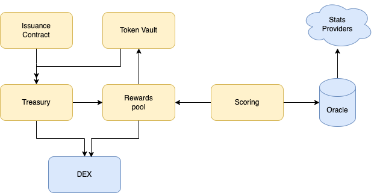

# Architecture

<figure><figcaption></figcaption></figure>

**Player Tokens**

These are the tokens representing the players. They are ERC20 compatible, fixed supply fungible tokens. They can be traded in any exchange and bridged to any network, because they are fully owned by the token holders.\

**Issuance Contract**

This is the contract that is responsible for the issuance of new tokens. Tokens are sold initially using a mechanism called Variable Rate Gradual Dutch Auctions (VRDA). Not all tokens are sold. Some are kept in the treasury and added as liquidity in the DEX Liquidity pool. The trading fees from the DEX are collected by the rewards pool.\

**Token Vault**

The token vault is where player tokens are staked. Token that are staked are eligible for performance based payouts. The payout amount is calculated and provided by the rewards pool. There is one vault instance per player token contract

**Scoring**

This is the logic that creates a score for each player from the Oracle data. This score is communicated to the rewards pool in order to calculate the rewards given to each player token.\

**Oracles**

Oracles are services connecting the blockchain to the external world. A single oracle comes with a centralisation risk, therefore a decentralised oracle service such as Chainlink \[5] will be used.

**Stats Providers**

Real life events and player statistics are needed by the protocol. These are provided by specialised companies. There has to be an integration between the Oracle and the stats provider.

**Treasury**

This is the DAO treasury account that is funded by fees and also stores the newly issued tokens before they are supplied to the DEX.

**Rewards Pool**

The rewards pool is a contract used to pay payouts to staked tokens in the vault. It is funded from the treasury, the player vault fees and the liquidity provision fees paid by the DEX.

**DEX**

This is a decentralised exchange where tokens can be traded on a secondary market. In time, the tokens will be listed on multiple exchanges on multiple networks.

